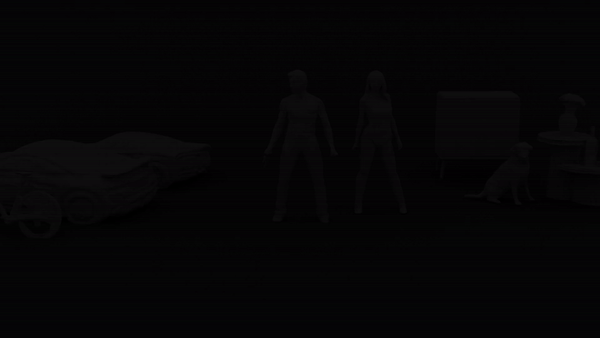
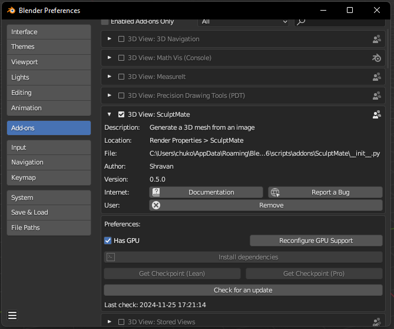
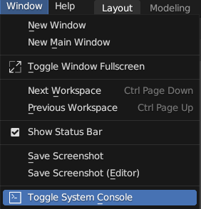

# SculptMate

SculptMate is a Blender add-on that simplifies the process of generating meshes. It automates a significant part of the game development pipeline, allowing users to quickly create meshes from a single image.

## Features

- Generate meshes of objects from a single image.
- Create background assets with ease allowing you more time to work on the important parts of your render.
- Get UV unwrapped maps and baked textures.

## Demo

## Installation

1. Download the latest release [zip file](https://github.com/shravan-d/SculptMate/archive/refs/tags/v0.5.zip) from the [Releases](https://github.com/shravan-d/SculptMate/releases) page.
2. You might have to start Blender with admin privileges for this step, depending on your Blender installation path.
3. In Blender, go to `Edit` > `Preferences` > `Add-Ons`.
4. Click on `Install` and select the downloaded zip file.
5. Enable the add-on by checking the checkbox next to its name.
6. If you have a GPU in your system, check the 'Has GPU' box. This will speed up the generation process.
7. Install the dependencies. 
8. Get the the checkpoint files that are required for the generation process. The Pro model requires a GPU to run.

## Usage

1. Open Blender and head to the Render Properties Tab.
2. Scroll down to find the SculptMate Panel.
3. If you have the dependencies installed, you can select an image of the object you'd like to generate a mesh of.
4. Click on Generate.

## Example Usage

## Contributing

Contributions are welcome! Feel free to fork the repository and submit pull requests with your improvements or bug fixes.

## Third-Party Libraries

This project utilizes the following third-party libraries:

- **Library:** [TripoSR - A state-of-the-art open-source model for fast feedforward 3D reconstruction.](https://stability.ai/news/triposr-3d-generation)
   - **Author:** Tripo AI and Stability AI
   - **Year:** 2024

- **Library:** [Stable Fast 3D: Rapid 3D Asset Generation From Single Images.](https://stability.ai/news/introducing-stable-fast-3d)
   - **Author:** Stability AI
   - **Year:** 2024

# Troubleshooting

If you are experiencing trouble getting SculptMate running, check Blender's system console (in the top left under the "Window" dropdown next to "File" and "Edit") for any error messages. Then [search in the issues list](https://github.com/shravan-d/SculptMate/issues) with your error message and symptoms.

> **Note** On macOS there is no option to open the system console. Instead, you can get logs by opening the app *Terminal*, entering the command `/Applications/Blender.app/Contents/MacOS/Blender` and pressing the Enter key. This will launch Blender and any error messages will show up in the Terminal app.

Features and feedback are also accepted on the issues page. If you have any issues that aren't listed, feel free to add them there!

The [SculptMate Discord server](https://discord.gg/SN36dpTAJz) also has a common issues list and a community of helpful people.